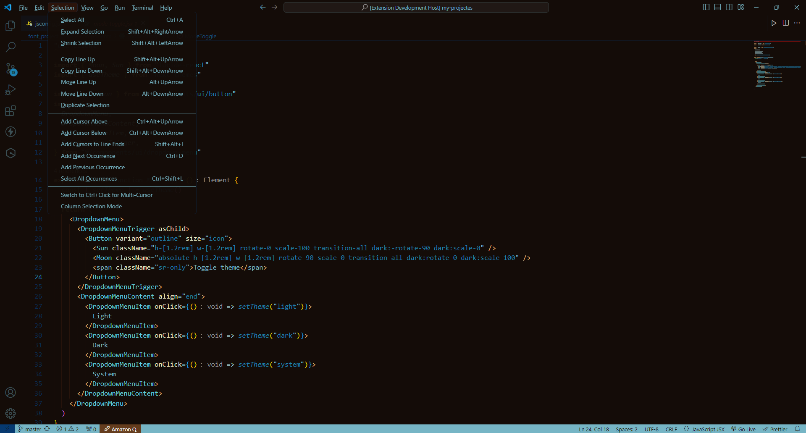

# Cyrus-Thales VS Code Theme 

Cyrus-Thales is a dark, brownish color theme for Visual Studio Code designed to enhance your coding experience with a unique and elegant look. Whether you’re coding late into the night or just prefer a warm, subdued aesthetic, Cyrus-Thales is here to provide a comfortable and visually appealing environment.





## Features

- **Dark Brownish Color Palette:** A rich and warm color scheme that reduces eye strain and creates a pleasant coding experience.
- **Syntax Highlighting:** Distinct color differentiation for various code elements to improve readability and help you spot errors faster.
- **Consistent Design:** Ensures a cohesive and polished look across different file types and code structures.

## Installation

To install the Cyrus-Thales theme, follow these steps:

1. **Open Visual Studio Code.**
2. **Navigate to the Extensions view** by clicking on the Extensions icon in the Activity Bar on the side of the window or pressing `Ctrl+Shift+X`.
3. **Search for "Cyrus-Thales"** in the Extensions Marketplace.
4. **Click on the install button** next to the Cyrus-Thales theme in the search results.

Alternatively, you can install it directly from the command line:

```bash
code --install-extension cyrus-thales.theme
```

## Usage

Once the extension is installed:

1. **Open the Command Palette** by pressing `Ctrl+Shift+P`.
2. **Type "Color Theme"** and select "Preferences: Color Theme".
3. **Choose "Cyrus-Thales"** from the list of available themes.

## Customization

If you'd like to customize the theme further, you can do so by modifying your user or workspace settings. For example, you can override specific colors by adding settings to your `settings.json` file:

```json
"workbench.colorCustomizations": {
    "editor.foreground": "#F5F5F5",
    "editor.background": "#3B2F1F"
}
```

Refer to the [Visual Studio Code documentation](https://code.visualstudio.com/docs/getstarted/keybindings) for more details on theme customization.

## Contribution

Contributions are welcome! If you have suggestions or want to contribute to the Cyrus-Thales theme, please open an issue or a pull request on the [GitHub repository](https://github.com/halo000000/cyrus-thales).

## License

This theme is licensed under the [MIT License](LICENSE).

## Feedback

We’d love to hear from you! Share your feedback or report issues on our [GitHub page](https://github.com/halo000000/cyrus-thales/issues).

Happy coding!😉

---
